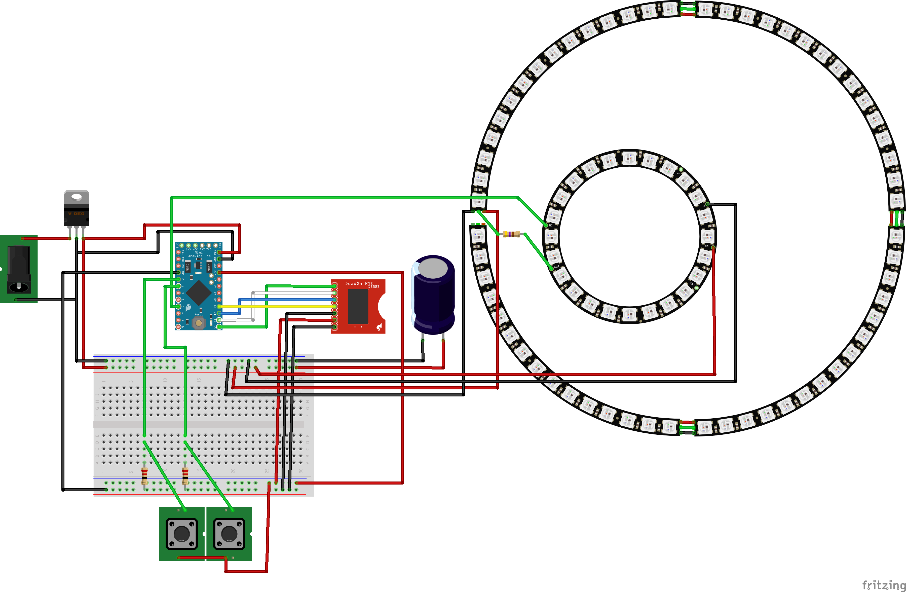

# Electronics

This is a (mostly) complete list of parts used to make the electronics for the clock:

You can also open the [NeoClock Fritzing File](./NeoClock.fzz) to see how it was set up.

## SparkFun Parts

- 1x [DeadOn RTC Breakout - DS3234](https://www.sparkfun.com/products/10160) (BOB-10160)
- 1x [Coin Cell Battery 12mm CR1225](https://www.sparkfun.com/products/337) (PRT-00337)
- 1x [Arduino Mini 328 - 5V/16MHz](https://www.sparkfun.com/products/11113) (DEV-11113)
- 1x [L7805 Voltage Regulator 5V 1.5A-Max](https://www.sparkfun.com/products/107) (COM-00107)
- Resistors Avalable in [Resistor Kit 1/4W 500 Total](https://www.sparkfun.com/products/10969) (COM-10960)
  - 1x 470 Ohm 1/4W Resistor (yellow, violet, brown, silver)
  - 2x 2.2 Ohm 1/4W Resistor (doesn't have to be exact here) (red, red, brown, silver, gold)

Also needed for programming the Arduino:

- 1x [FTDI Cable 5V](https://www.sparkfun.com/products/9718) (DEV-09718)

Also some wire:

- 1x [Hook-Up Wire - Assortment](https://www.sparkfun.com/products/11367) (Solid Core, 22 AWG ROHS) (PRT-11367)
  - This project used Red, Black and Green primarily.  Secondary colors are Yellow, Blue, White.

## Adafruit Parts

- 1x [NeoPixel Ring - 24 x WS2812 5050 RGB LED with Integrated Drivers](https://www.adafruit.com/product/1586) (1586)
- 4x [NeoPixel 1/4 60 Ring - 5050 RGB LED w/ Integrated Drivers](https://www.adafruit.com/product/1768) (1768)

## Radio Shack Parts

- 12V 1.5A Power Supply
- 1x [1000uF Electrolytic Capacitor](https://www.radioshack.com/products/radioshack-1000uf-35v-20-axial-lead-electrolytic-capacitor) (Axial Leads, 35WVDC max) (272-1019)
- 2x [SPST Momentary Pushbutton Switch](https://www.radioshack.com/products/spst-pushbtn-swch) Contacts (N.O.) rated 3A at 125VAC or 1.5A at 250VAC (275-0644)
- 1x [Size K Coaxial DC Power Jack with Switch](https://www.radioshack.com/products/radioshack-size-k-coaxial-dc-power-jack-w-switch) (N.C. break circuit, 5.0mm OD, 2.1mm ID, with mounting hardware) (274-1565)
- 1x Mixed Round circuit boards
  - 1x 30mm in diameter
  - 1x 25mm in diameter
  - 1x 15mm in diameter

## Home Depot Parts

- 1x [Super Magnets, 12 Neodymium Ring Magnets](https://www.homedepot.com/p/MASTER-MAGNETICS-3-8-in-Neodymium-Rare-Earth-Magnet-Discs-12-per-Pack-07090HD/202526371) (095421070909)
- 1x [Gorilla Wood Glue](https://www.homedepot.com/p/Gorilla-8-fl-oz-Wood-Glue-62000/100672167) (052427620002)
- 1x [3/8 in x 4 ft wood round dowel](https://www.homedepot.com/p/3-8-in-x-48-in-Wood-Round-Dowel-HDDH3848/204354371)

## Other Parts

- Heat Shrink Tubing
- Quick Disconnects for wires
